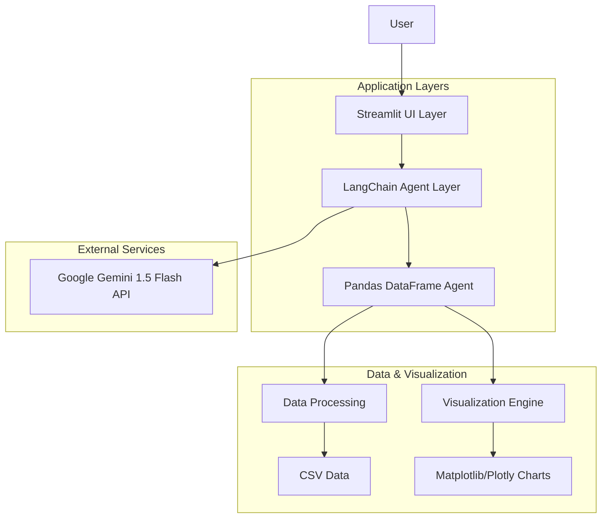

# Design Document

## Overview

The CSV Data Analyst is a conversational AI application that enables users to analyze CSV data through natural language queries. The system follows a clean three-tier architecture with Streamlit handling the user interface, LangChain orchestrating the AI logic, and Google Gemini 1.5 Flash providing the language model capabilities. The core functionality revolves around a pandas DataFrame agent that can execute data analysis tasks and generate visualizations based on user questions.

## Architecture

### High-Level Architecture



### Component Separation

1. **Presentation Layer (Streamlit)**: Handles user interactions, file uploads, and display of results
2. **Business Logic Layer (LangChain)**: Orchestrates AI operations and manages conversation flow
3. **Data Processing Layer (Pandas Agent)**: Executes data analysis and generates visualizations
4. **External API Layer (Google Gemini)**: Provides natural language understanding and generation

## Components and Interfaces

### 1. Streamlit UI Components

#### Main Application Interface
- **File Upload Component**: Handles CSV file selection and validation
- **Data Preview Component**: Displays uploaded data summary and preview
- **Chat Interface Component**: Manages question input and conversation display
- **Visualization Display Component**: Renders charts and graphs
- **Session State Manager**: Maintains application state across interactions

#### Key UI Functions
```python
def render_file_upload() -> pd.DataFrame | None
def render_data_preview(df: pd.DataFrame) -> None
def render_chat_interface() -> str | None
def render_conversation_history() -> None
def display_visualization(chart_data: Any) -> None
```

### 2. LangChain Agent Layer

#### Agent Configuration
- **ChatGoogleGenerativeAI**: Primary LLM interface using gemini-1.5-flash-latest
- **Pandas DataFrame Agent**: Specialized agent for data analysis tasks
- **Memory Management**: Conversation buffer for maintaining context
- **Tool Integration**: Custom tools for visualization generation

#### Core Agent Classes
```python
class CSVAnalystAgent:
    def __init__(self, api_key: str)
    def load_dataframe(self, df: pd.DataFrame) -> None
    def process_query(self, question: str) -> AgentResponse
    def get_conversation_history() -> List[Message]
    def clear_memory() -> None

class AgentResponse:
    text_response: str
    visualization: Optional[Any]
    execution_details: Dict[str, Any]
```

### 3. Data Processing Engine

#### DataFrame Management
- **Data Loader**: CSV parsing and DataFrame creation
- **Data Validator**: Type detection and data quality checks
- **Statistics Generator**: Basic data summaries and insights

#### Visualization Engine
- **Chart Factory**: Determines appropriate visualization types
- **Matplotlib Integration**: Static chart generation
- **Plotly Integration**: Interactive chart generation
- **Chart Renderer**: Streamlit-compatible chart display

### 4. Configuration Management

#### Environment Configuration
```python
class Config:
    GOOGLE_API_KEY: str
    MAX_FILE_SIZE: int = 50_000_000  # 50MB
    MAX_CONVERSATION_HISTORY: int = 10
    DEFAULT_CHART_LIBRARY: str = "plotly"
    SUPPORTED_FILE_TYPES: List[str] = [".csv"]
```

## Data Models

### Core Data Structures

#### DataFrameInfo
```python
@dataclass
class DataFrameInfo:
    shape: Tuple[int, int]
    columns: List[str]
    dtypes: Dict[str, str]
    null_counts: Dict[str, int]
    memory_usage: str
    sample_data: pd.DataFrame
```

#### ConversationMessage
```python
@dataclass
class ConversationMessage:
    role: str  # "user" or "assistant"
    content: str
    timestamp: datetime
    visualization: Optional[Any] = None
    metadata: Dict[str, Any] = field(default_factory=dict)
```

#### AnalysisResult
```python
@dataclass
class AnalysisResult:
    query: str
    text_response: str
    visualization: Optional[Any]
    execution_code: Optional[str]
    execution_time: float
    success: bool
    error_message: Optional[str] = None
```

### Session State Schema
```python
class SessionState:
    uploaded_file: Optional[UploadedFile]
    dataframe: Optional[pd.DataFrame]
    dataframe_info: Optional[DataFrameInfo]
    agent: Optional[CSVAnalystAgent]
    conversation_history: List[ConversationMessage]
    current_query: str
    is_processing: bool
```

## Error Handling

### Error Categories and Responses

#### File Upload Errors
- **Invalid File Format**: Clear message with supported formats
- **File Size Exceeded**: Specific size limit information
- **Parsing Errors**: Detailed CSV parsing error messages
- **Empty File**: Guidance for providing valid data

#### API and Processing Errors
- **Google API Errors**: Rate limiting, authentication, and quota handling
- **Agent Execution Errors**: Code execution failures with safe error messages
- **Memory Errors**: Large dataset handling and memory optimization
- **Network Errors**: Offline mode guidance and retry mechanisms

#### User Input Errors
- **Ambiguous Questions**: Clarification requests with examples
- **Unsupported Analysis**: Clear explanation of limitations
- **Context Loss**: Session recovery and data reloading prompts

### Error Recovery Strategies
```python
class ErrorHandler:
    def handle_api_error(self, error: Exception) -> str
    def handle_processing_error(self, error: Exception) -> str
    def handle_file_error(self, error: Exception) -> str
    def suggest_recovery_action(self, error_type: str) -> str
```

## Testing Strategy

### Unit Testing Approach

#### Component Testing
- **Streamlit Components**: UI rendering and interaction testing
- **LangChain Agent**: Query processing and response generation
- **Data Processing**: DataFrame operations and validation
- **Visualization**: Chart generation and rendering

#### Test Categories
```python
class TestSuite:
    # UI Component Tests
    def test_file_upload_validation()
    def test_data_preview_rendering()
    def test_chat_interface_functionality()
    
    # Agent Tests
    def test_agent_initialization()
    def test_query_processing()
    def test_conversation_memory()
    
    # Data Processing Tests
    def test_csv_parsing()
    def test_dataframe_analysis()
    def test_visualization_generation()
    
    # Integration Tests
    def test_end_to_end_workflow()
    def test_error_handling_flows()
```

### Integration Testing

#### API Integration Tests
- **Google Gemini API**: Authentication, rate limiting, response handling
- **LangChain Integration**: Agent creation, tool usage, memory management
- **Visualization Libraries**: Chart generation and Streamlit integration

#### User Workflow Tests
- **Complete Analysis Flow**: Upload → Preview → Query → Response → Visualization
- **Conversation Continuity**: Multi-turn conversations with context preservation
- **Error Recovery**: Graceful handling of various error scenarios

### Performance Testing

#### Load Testing Scenarios
- **Large CSV Files**: Performance with datasets up to size limits
- **Complex Queries**: Response times for computationally intensive analysis
- **Memory Usage**: Monitoring memory consumption during extended sessions
- **Concurrent Users**: Multi-user session handling (if applicable)

#### Performance Metrics
- **Response Time**: Target < 10 seconds for typical queries
- **Memory Usage**: Efficient DataFrame handling and garbage collection
- **API Rate Limits**: Respectful usage of Google Gemini API quotas
- **Visualization Rendering**: Fast chart generation and display

### Mock Testing Strategy

#### External Service Mocking
- **Google Gemini API**: Mock responses for consistent testing
- **File System Operations**: Temporary file handling for tests
- **Network Requests**: Offline testing capabilities

#### Test Data Management
- **Sample CSV Files**: Various data types and sizes for comprehensive testing
- **Edge Case Data**: Empty files, malformed data, special characters
- **Conversation Scenarios**: Pre-defined question-answer flows